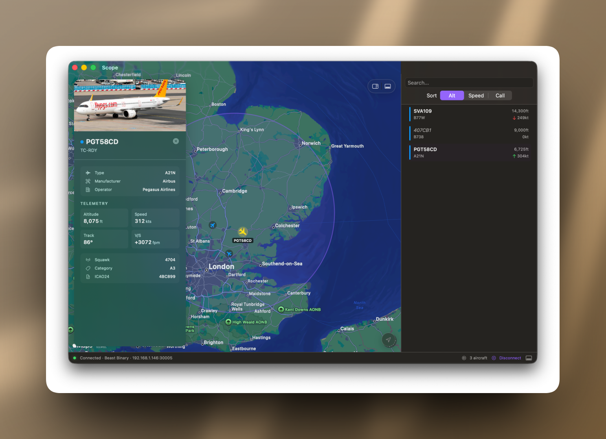

# Scope

Native macOS app for tracking ADS-B aircraft from any remote dump1090 instance. Built in SwiftUI with SF design. Free.


  

## What It Does

- Connects to a dump1090 instance (your RPi, cloud feeder, anywhere)
- Displays aircraft on a full-screen map
- Sidebar with live aircraft list
- Click any aircraft → inspector overlay shows registration, type, airline, photos
- Updates every 250ms
- Works with 1000+ aircraft
- Dark mode (LHR purple) and light mode

## Pictures



## Install

Download the DMG from [Releases](https://github.com/yourusername/scope-adsb/releases). Drag into Applications. Launch.

On first run, enter your dump1090 endpoint (e.g., `192.168.1.50:8080` for your RPi, or any public feeder). Scope polls `/data/aircraft.json` and renders aircraft on the map.

**Requirements:** macOS 12+, network access to a dump1090 instance.

## Config

Edit `~/Library/Application Support/Scope/config.json`:

```json
{
  "endpoint": "http://192.168.1.50:8080",
  "refreshMs": 250,
  "apiProvider": "airplanes.live",
  "mapCenter": { "lat": 51.5074, "lon": -0.1278 },
  "theme": "auto"
}
```

Metadata cache lives in the same directory. Delete it anytime to force a fresh pull.

## Architecture

See [ARCHITECTURE.md](ARCHITECTURE.md) for technical details: data flow, API strategy, performance considerations.

## Roadmap

**v1.0** — Remote dump1090, map + sidebar + inspector, airplanes.live metadata

**v1.1** — Local USB decoding (NooElec via librtlsdr), persistent logging, custom alerts

**v2.0** — MLAT, multi-feeder aggregation, heatmaps

## License

MIT.

## Issues

File at [GitHub Issues](https://github.com/yourusername/scope-adsb/issues).

See [SPEC.md](SPEC.md) for full feature spec and [ARCHITECTURE.md](ARCHITECTURE.md) for technical design.
